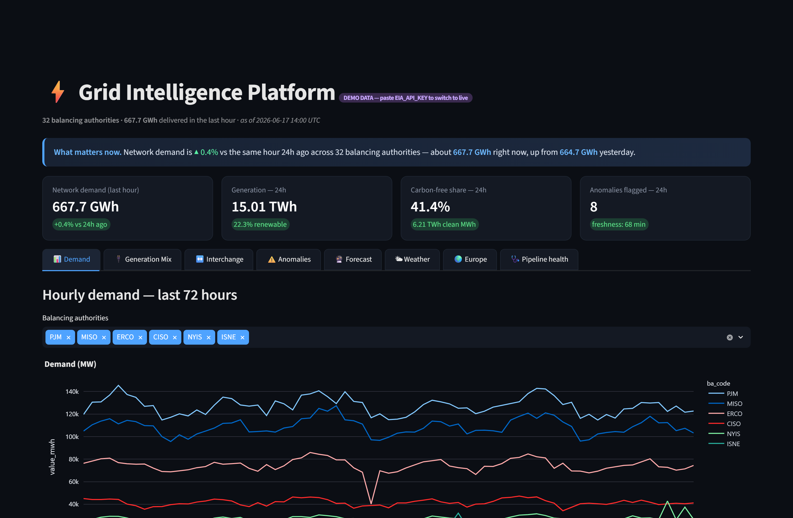
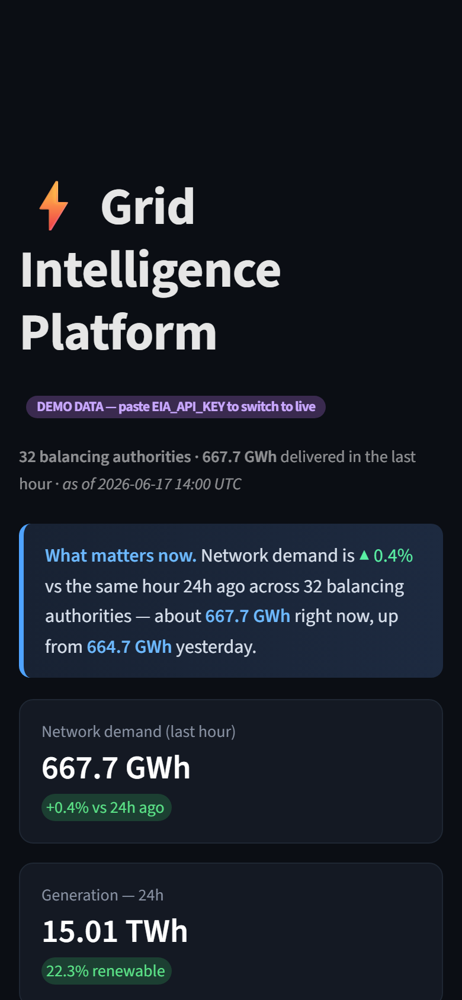
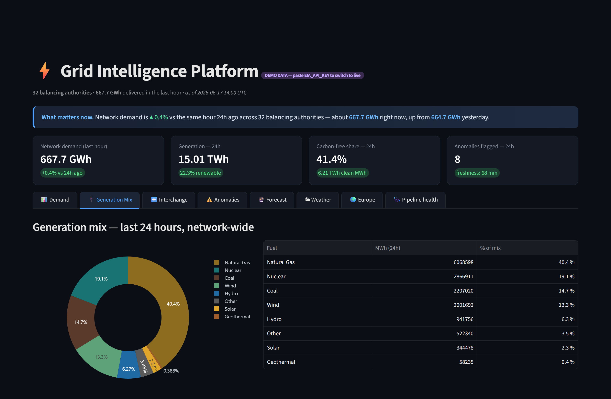
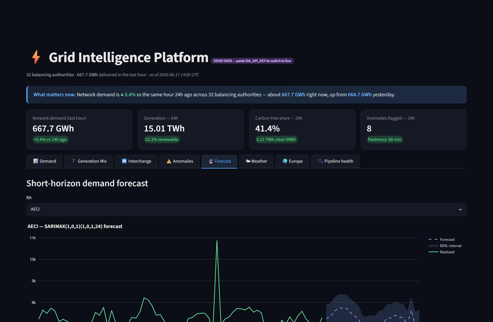
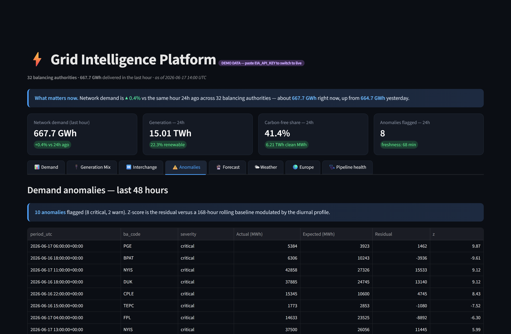
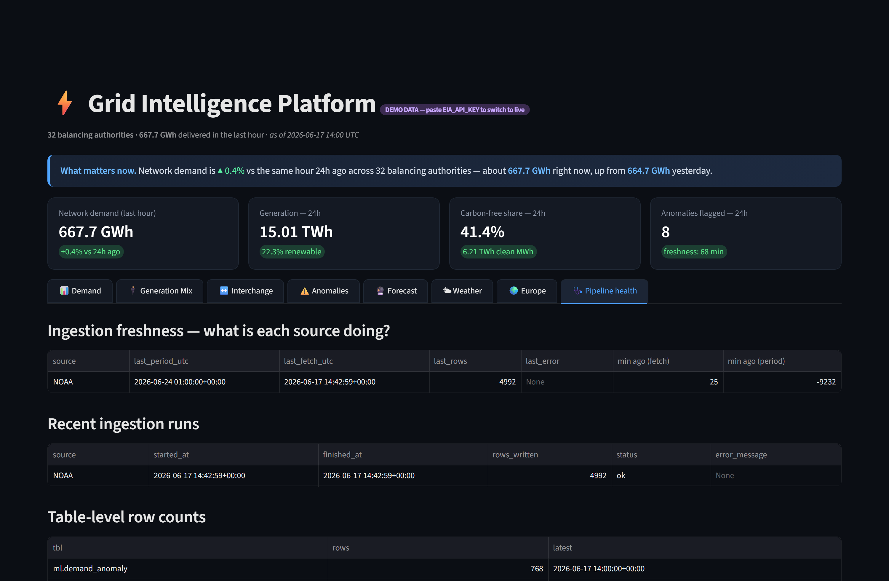
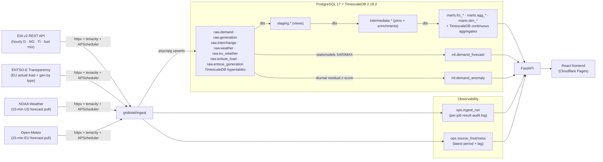

# ⚡ Grid Intelligence Platform

**A real-time intelligence platform that streams every hour of US (EIA) and
European (ENTSO-E) electricity grid data into a TimescaleDB warehouse, runs
anomaly detection and a 24-hour demand forecast on it, and serves it through a
FastAPI JSON service and a senior-grade React dashboard
([grid.scottcampbell.io](https://grid.scottcampbell.io)).**

<p>
  <a href="https://github.com/scottcampbelldata/grid-intelligence-platform/actions/workflows/ci.yml">
    
  </a>
  
  
  
  
  
  
  
  
</p>

---

## 📊 What the platform tracks

Every hour, three independent streaming jobs land fresh observations into a
**TimescaleDB hypertable** layout. dbt models them, ML scores them, FastAPI
serves them, and a React frontend (Cloudflare Pages) displays them.

| Metric (live) | Value | Source |
|---|---:|---|
| US balancing authorities tracked | **65+** | EIA RTO API |
| European bidding zones tracked   | **20**  | ENTSO-E Transparency API |
| NOAA weather points refreshed every 15 min | **32** | api.weather.gov |
| Open-Meteo EU weather zones refreshed every 15 min | **20** | api.open-meteo.com (CC BY 4.0) |
| Hourly demand rows (raw warehouse, 14d) | **10,752+** | EIA `region-data` series `D` |
| Generation-by-fuel rows (14d)           | **67,536+** | EIA `fuel-type-data` |
| Inter-BA interchange rows (14d)         | **8,064+**  | EIA `interchange-data` |
| Weather observations (live)             | **4,992** | NOAA `/gridpoints/.../forecast/hourly` |
| ML anomaly scores (24h scoring window)  | **768**   | SARIMAX residual + diurnal-normalised z-score |
| Short-horizon forecasts (24h × 32 BAs)  | **768**   | SARIMAX(1,0,1)(1,0,1,24) per BA |
| dbt tests / pytest                      | **34 / 20** | run on every CI build |

Numbers come from `gridintel status` against my live cluster on 2026-06-17.
With an EIA API key pasted into `.env`, the same tables refill from live API
data on the EIA / ENTSO-E / NOAA cron cadence (see "Streaming cadence" below).

> **Where live data starts and where the seed ends.** The repo ships with a
> deterministic, plausible synthetic generator (`gridintel seed-demo`) so the
> entire pipeline - schema, dbt, ML, dashboard, tests - is exercisable from a
> fresh clone before you've registered for any third-party API key. Every
> synthetic row is tagged `source='DEMO'` and can be removed by
> `gridintel purge-demo`. Once `EIA_API_KEY` is set, the scheduler writes real
> rows alongside (`source='EIA'`) and the frontend's data badge flips to **LIVE**.

---

## 🖥️ The dashboard

**Live at [grid.scottcampbell.io](https://grid.scottcampbell.io)** - a React SPA
deployed on **Cloudflare Pages**, talking to the FastAPI service at
[api.grid.scottcampbell.io](https://api.grid.scottcampbell.io). Dark theme,
mobile-responsive, **auto-refreshes every 60s**. Built so a senior hiring
manager can look at it on a phone in 10 seconds and read the story.



<p align="center">
  
</p>

**Tabs:** Demand · Generation Mix · Interchange · Anomalies · Forecast · Weather
· Europe · Pipeline health.

<p>
  
  
  
  
</p>

### Two consumers, one warehouse - React frontend + Power BI

The same dbt marts feed **both** the live web dashboard and a **Power BI
executive deck**. The React app is the real-time operations view
(auto-refresh, anomaly drill-downs); the Power BI
report is the slice-and-dice exec deck driven by ten CSV mart extracts +
a [reusable DAX measures pack](powerbi/measures.dax) +
a [dark Grid Intel theme](powerbi/theme.json).

Build guide: **[powerbi/README.md](powerbi/README.md)**.

> Pattern: business logic lives in **dbt**; presentation is whichever tool
> the audience already uses. The marts are deliberately tool-agnostic.

---

## 🏗️ Architecture



**Streaming cadence (UTC).** Mirrors each upstream's actual publish schedule.

| Source       | Path                                | Cron              | Notes |
|---|---|---|---|
| EIA region   | `/electricity/rto/region-data/data` | minute = 7        | demand / forecast / net-gen / interchange |
| EIA fuel mix | `/electricity/rto/fuel-type-data`   | minute = 8        | 10 fuel codes (COL, NG, NUC, SUN, WND, ...) |
| EIA interchange | `/electricity/rto/interchange-data` | minute = 9   | inter-BA flows |
| ENTSO-E load | `/api`                              | minute = 20       | actual load per bidding zone |
| ENTSO-E gen  | `/api`                              | minute = 22       | per-PSR-type generation |
| NOAA         | `/points/.../forecast/hourly`       | every 15 min      | concurrency-bounded, polite UA |
| Open-Meteo   | `/v1/forecast` (per EU zone)        | every 15 min      | EU weather, no key, CC BY 4.0; per-zone skip on error |
| ML anomaly   | derived from `raw.demand`           | minute = 15, 45   | 32 BAs × 24h scoring window |
| ML forecast  | derived from `raw.demand`           | minute = 30       | 24h SARIMAX horizon per BA |

Each job is **idempotent** - `INSERT ... ON CONFLICT DO UPDATE` keyed on the
natural composite (period, BA, [series], [source]). Late-arriving facts
(common in EIA's TI series) overwrite cleanly. Every run records to
`ops.ingest_run` for audit and updates `ops.source_freshness` for the
"Pipeline health" tab.

---

## 🧰 Tech stack

| Layer | Tooling |
|---|---|
| **Ingestion**  | `httpx` (async), `tenacity` exponential-jitter retry, `APScheduler` AsyncIO scheduler, `loguru` structured logging |
| **Warehouse**  | **PostgreSQL 17.5** + **TimescaleDB 2.18.2** - 9 hypertables, continuous aggregates (`marts.demand_hourly`, `marts.demand_daily`, `marts.generation_hourly`), compression policies after 7d, 730d retention |
| **Transformation** | **dbt-postgres** - sources / staging / intermediate / marts, incremental + late-arriving fact handling, surrogate keys (`dbt_utils.generate_surrogate_key`), exposures, persisted docs |
| **ML**         | `statsmodels` SARIMAX(1,0,1)(1,0,1,24) per BA with seasonal-naive fallback; diurnal-normalised rolling-z anomaly detector |
| **API**        | `FastAPI` + `uvicorn` - auto-generated OpenAPI at `/docs`, 14 JSON endpoints |
| **Frontend**   | `React` SPA on **Cloudflare Pages** (`grid.scottcampbell.io`), dark theme, auto-refresh, mobile viewport - consumes the FastAPI JSON API |
| **Tests**      | **20 pytest** (incl. `respx` HTTP mocks + `hypothesis` property-based) · **34 dbt tests** (generic + sources + uniqueness) |
| **CI**         | GitHub Actions - ruff lint · mypy · Postgres service · seed-demo · dbt build · dbt test · ML jobs · pytest |
| **Auto-start** | Hidden VBS launchers in Windows Startup folder (no service install, no admin) |

---

## 🚀 Quickstart - Windows, no Docker, no admin

The warehouse is **native PostgreSQL** + **TimescaleDB** with neither installer
requiring admin once the EDB binaries are unzipped into a user-owned folder.

```powershell
# 1. Python environment
python -m venv .venv
.venv\Scripts\activate
pip install -r requirements.txt
pip install -r requirements-dev.txt      # only if you want lint/test/screenshot

# 2. PostgreSQL 17 - install (one-time) either via winget or by reusing
#    an existing user-owned install at C:\Users\<you>\PostgreSQL\17\
#       winget install -e --id PostgreSQL.PostgreSQL.17
#    Then plant the TimescaleDB extension without admin:
powershell -ExecutionPolicy Bypass -File scripts\install-timescaledb.ps1

# 3. Bootstrap the database (creates grid_intel + grid_app + schemas + hypertables)
powershell -ExecutionPolicy Bypass -File scripts\setup-database.ps1

# 4. Copy the env template and fill it in
copy .env.example .env
#    Edit .env → paste PGPASSWORD (printed by the previous step),
#    EIA_API_KEY (register at https://www.eia.gov/opendata/register.php),
#    ENTSOE_API_KEY (register at https://transparency.entsoe.eu/).

# 5. Bring the platform alive end-to-end
python -m gridintel.cli seed-reference             # BA + US weather-station + EU zone-centroid reference data (run once after init-db)
python -m gridintel.cli seed-demo --days 14        # plausible synthetic demand (skip if keys are set)
python -m gridintel.cli backfill --hours 168       # OR fetch the last week of real data
cd dbt && dbt deps && dbt build && cd ..           # 6 views + 4 tables + 3 incremental facts + 34 tests
python -m gridintel.cli ml anomaly                 # 24h rolling anomaly score
python -m gridintel.cli ml forecast                # 24h SARIMAX per BA

# 6. Launch the long-lived services (each goes into Windows Startup so they
#    auto-restore on logon)
powershell -ExecutionPolicy Bypass -File scripts\install-autostart.ps1
#    → starts: gridintel scheduler · gridintel api
#    → http://127.0.0.1:8787    FastAPI ( /docs )
#    → frontend is the React SPA at https://grid.scottcampbell.io (Cloudflare Pages)
```

```powershell
# Quality gates
.venv\Scripts\python.exe -m pytest tests -q                # 20 tests
.venv\Scripts\python.exe -m ruff check gridintel tests scripts
cd dbt && dbt test                                        # 34 dbt data-quality tests
cd dbt && dbt docs generate; dbt docs serve               # interactive DAG + column lineage
```

### Streaming health, at a glance

```powershell
python -m gridintel.cli status
```

```
                         Table counts
+------------------------------------------------------------+
| Table                 |   Rows | Latest UTC                |
|-----------------------+--------+---------------------------|
| raw.demand            | 10,752 | 2026-06-17 10:00:00 UTC   |
| raw.demand_forecast   | 10,752 | 2026-06-17 10:00:00 UTC   |
| raw.generation        | 67,536 | 2026-06-17 10:00:00 UTC   |
| raw.interchange       |  8,064 | 2026-06-17 10:00:00 UTC   |
| raw.weather           |  4,992 | 2026-06-23 21:00:00 UTC   |  ← real NOAA
| ml.demand_forecast    |    768 | 2026-06-18 10:00:00 UTC   |
| ml.demand_anomaly     |    768 | 2026-06-17 10:00:00 UTC   |
+------------------------------------------------------------+
```

---

## 📂 Repository layout

```
grid-intelligence-platform/
├── gridintel/                # Python package
│   ├── cli.py                # Typer CLI: init-db / seed-reference / seed-demo / ingest / ml / api / scheduler / status
│   ├── config.py             # pydantic-settings env + .env loader
│   ├── logging_setup.py      # loguru console + rotating file sink
│   ├── db/
│   │   ├── engine.py         # SQLAlchemy engine + raw psycopg helpers + ON CONFLICT upsert + COPY
│   │   ├── schema.sql        # raw / staging / marts / ml / ops + hypertables (Timescale-aware)
│   │   └── policies.sql      # compression / retention / continuous-aggregate policies
│   ├── ingest/
│   │   ├── _http.py          # shared httpx client + tenacity retry policy
│   │   ├── eia.py            # EIA v2 paginated client (region / fuel-type / interchange)
│   │   ├── entsoe.py         # ENTSO-E XML parser (A65 load + A75 gen-per-type)
│   │   ├── noaa.py           # NOAA gridpoint resolution + hourly forecast (US)
│   │   ├── openmeteo.py      # Open-Meteo per-zone forecast + WMO codes (EU)
│   │   ├── reference.py      # seed BA + weather-station + EU-zone centroids
│   │   ├── persist.py        # payload → relational rows + bulk upserts
│   │   ├── jobs.py           # high-level jobs the scheduler calls
│   │   └── demo_seed.py      # deterministic synthetic generator
│   ├── ml/jobs.py            # SARIMAX forecast + diurnal-z anomaly scan
│   ├── api/main.py           # FastAPI service (14 endpoints)
│   ├── scheduler/service.py  # AsyncIO APScheduler + cron triggers
│   └── ...
├── dbt/                      # dbt-postgres project
│   ├── dbt_project.yml · profiles.yml · packages.yml
│   ├── models/sources.yml    # raw / ops / ml sources w/ freshness SLA
│   ├── models/staging/       # stg_demand, stg_demand_forecast, stg_generation, stg_interchange
│   ├── models/intermediate/  # int_demand_with_forecast, int_generation_with_meta
│   ├── models/marts/         # fct_demand_hourly (incremental) · fct_generation_hourly (incremental)
│   │                         # fct_interchange_hourly (incremental) · agg_demand_recent
│   │                         # agg_generation_mix_recent · agg_renewable_share_network
│   │                         # dim_balancing_authority (surrogate key)
│   ├── models/marts/schema.yml  # tests + exposure → React frontend
│   └── seeds/                # fuel_type_meta.csv · balancing_authority_meta.csv
├── scripts/                  # install-timescaledb.ps1 · setup-database.ps1
│                             # install-autostart.ps1
│                             # start-{api,scheduler}.{cmd,vbs}
├── tests/                    # pytest + respx + hypothesis
├── .github/workflows/ci.yml  # ruff · mypy · seed · dbt build · dbt test · ML · pytest
├── docs/images/              # dashboard, generation_mix, forecast, anomalies, pipeline_health, ...
├── Makefile · pyproject.toml · requirements.txt · requirements-dev.txt · .env.example
└── README.md (this file)
```

---

## 🔬 The ML layer

Two pieces, both lightweight enough to retrain every 30 minutes per BA:

* **`gridintel.ml.jobs.run_demand_forecast`** - fits a
  `SARIMAX(1,0,1)(1,0,1,24)` per balancing authority on the last 14 days of
  realised demand, forecasts the next 24 hours, and writes
  `(yhat, yhat_lower, yhat_upper)` to `ml.demand_forecast`. If MLE doesn't
  converge for a particular BA (small series, gappy data) the job
  fail-softs to a **24-hour seasonal-naive** baseline so the dashboard
  always has *something* to show.

* **`gridintel.ml.jobs.run_anomaly_scan`** - computes an expected value per
  hour as the 7-day rolling mean modulated by that BA's 14-day diurnal
  profile, z-scores the residual using a rolling 168-hour standard
  deviation, and flags `|z| ≥ 3` as **critical**, `2 ≤ |z| < 3` as **warn**.
  Re-runs every 15 / 45 minutes past the hour so scored hours sharpen as more
  data lands.

Both jobs use `asyncio.to_thread` to fan out CPU-bound `statsmodels` fits
across BAs without blocking the AsyncIO scheduler.

---

## ✅ What this demonstrates (for senior data-engineering hiring)

| Senior-DE capability | Where it shows up |
|---|---|
| **Streaming / real-time ingestion** | 3 independent async clients on independent cron cadences, idempotent upserts, retry policy with exponential jitter, per-source freshness SLA enforced by dbt source `freshness:` blocks |
| **Time-series at scale**            | **TimescaleDB hypertables**, **continuous aggregates** for 1h/24h rollups, compression after 7d, 730d retention policy, all set up without admin |
| **dbt / analytics engineering**     | staging → intermediate → marts, incremental + late-arriving fact handling, surrogate keys, `dbt_utils`, sources with freshness, **exposure linking to the React frontend**, 34 data-quality tests |
| **API design**                      | FastAPI with auto-generated OpenAPI, 14 JSON endpoints, clean separation from the UI |
| **ML in production analytics**      | SARIMAX per-series with seasonal-naive fail-soft, diurnal-normalised rolling-z anomaly detector, both re-scored on cron |
| **Observability**                   | `ops.ingest_run` audit log, `ops.source_freshness` materialised state, the frontend's "Pipeline health" view showing lag in minutes per source |
| **Data quality**                    | pytest (20) with `respx` HTTP mocks + `hypothesis` property-based + dbt (34) including source freshness; both wired into CI |
| **Software craft**                  | type-hinted, docstringed Python; `loguru` structured logging with rotation; `gridintel` Typer CLI; `pyproject.toml`; ruff lint clean; GitHub Actions CI on Postgres 17 service |
| **Cloud / scale path**              | PostgreSQL today; the dbt project retargets to **Snowflake / BigQuery / Redshift** by an adapter swap (continuous aggregates → scheduled refresh tables on those platforms); the FastAPI layer is unaltered |
| **Production runtime**              | hidden Windows Startup launchers for API / scheduler, scram-sha-256 auth, least-priv app role |

---

## 🧪 Data & integrity

* **EIA v2 RTO endpoints.** US government, [public domain](https://www.eia.gov/about/copyrights_reuse.php).
  Hourly demand, demand forecast, net generation by fuel type, and inter-BA
  interchange across ~70 US balancing authorities.
* **ENTSO-E Transparency Platform.** EU public-data licence. Hourly actual
  load and generation per PSR (production type) per bidding zone.
* **NOAA api.weather.gov.** US government, no key, only a contact `User-Agent`.
  Hourly gridded forecasts at the centroid of each BA we track.
* **Open-Meteo (api.open-meteo.com).** Free, no key. Hourly forecast at the
  centroid of each European bidding zone - the EU parallel to NOAA. Data under
  [CC BY 4.0](https://open-meteo.com/en/license); non-commercial free tier.
  **Attribution:** "Weather data by Open-Meteo.com" - surfaced in the UI.
* **Synthetic seed (when API keys are not yet configured).** A deterministic
  per-BA hourly generator (seeded `random.Random(20260617)`) writes rows
  tagged `source='DEMO'` so they're trivially distinguishable from real
  rows (`source='EIA'` / `'ENTSOE'`) and purgeable in one command.
  Diurnal shape, weekend dampening, BA-specific load magnitudes and
  region-typical fuel mixes are calibrated to plausible US grid behaviour.

---

## 👤 Author

**Scott Campbell** - Business Intelligence & Data Engineering.
M.S. in IT/IS Management (BI track), University of Arizona.

This is **Project 2** of my data-engineering portfolio. Project 1 - the
[Manufacturing Intelligence Pipeline](../manufacturing-intelligence-pipeline) -
covers the batch / warehouse / ML side using 924k semiconductor process
readings and a dbt + Streamlit stack. This one covers the **streaming /
real-time** side: a live tailwind of grid data being ingested, dbt-modelled,
anomaly-scored, and surfaced to a dashboard every hour, on its own
production runtime.
